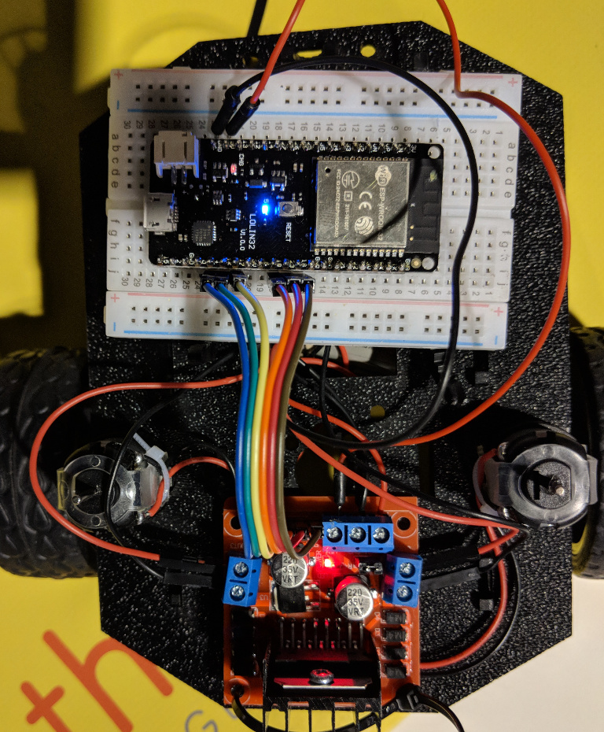
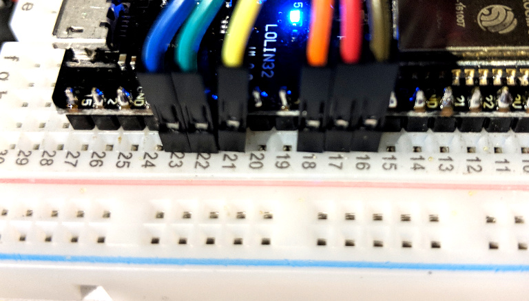
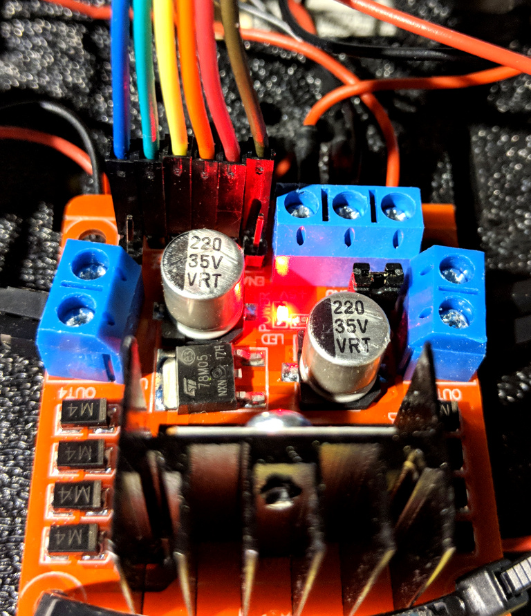
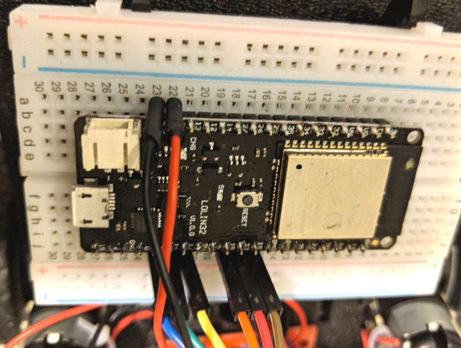

# Citrix Synergy  - Simply Serve


## Our bots



* ESP32 - Micrcontroller
* L298N - Motor Driver
* Motors
* Chassis
* Batteries
* wheels
* Wires

## Web Bluetooth


## Bot Assembly

* connect wheels
* connect fin
* connect battery pack
* connect breadboad bracket
* wiring
* customize


## Wiring






## connecting to the bot

[https://chirpers.com/browser](https://chirpers.com/browser)

## Bot connecting.

* service Id: `bada5555-e91f-1337-a49b-8675309fb099`

* digital Characteristic `2a56`

* analog Characteristic `2a58`

```javascript
[{"id":"w7289B2H_X4","type":"bluetooth out","z":"UFiUzfL0xVA","name":"digital","characteristicId":"2a56","bleServiceId":"bada5555-e91f-1337-a49b-8675309fb099","x":636,"y":157,"wires":[]},{"id":"IMIdfb8ZRDc","type":"bluetooth out","z":"UFiUzfL0xVA","name":"analog","characteristicId":"2a58","bleServiceId":"bada5555-e91f-1337-a49b-8675309fb099","x":648,"y":421,"wires":[]},{"id":"XLiyeeZNfHg","type":"iot buttons","z":"UFiUzfL0xVA","x":79.5,"y":38,"wires":[["ZpGYRy-6SjU"]]},{"id":"ZpGYRy-6SjU","type":"switch","z":"UFiUzfL0xVA","name":"","property":"payload","propertyType":"msg","rules":[{"t":"eq","v":"2","vt":"num"},{"t":"eq","v":"10","vt":"num"},{"t":"eq","v":"5","vt":"num"},{"t":"eq","v":"7","vt":"num"},{"t":"eq","v":"6","vt":"num"},{"t":"eq","v":"4","vt":"num"},{"t":"eq","v":"8","vt":"num"},{"t":"eq","v":"1","vt":"str"}],"checkall":"true","outputs":8,"x":157,"y":270,"wires":[["3G19J9pm8kg"],["Vy_DQgVO6Tg"],["ABJ-PXjp8L8"],["s1Vjl8NOHVM"],["in0eScdUR_o"],["m3dKjykASr8"],["tVJtHjltcWw"],[]]},{"id":"in0eScdUR_o","type":"change","z":"UFiUzfL0xVA","name":"stop","rules":[{"t":"set","p":"payload","pt":"msg","to":"[19,0,0,4,0,0]","tot":"json"}],"action":"","property":"","from":"","to":"","reg":false,"x":415,"y":366,"wires":[["IMIdfb8ZRDc"]]},{"id":"m3dKjykASr8","type":"change","z":"UFiUzfL0xVA","name":"medium","rules":[{"t":"set","p":"payload","pt":"msg","to":"[19,200,0,4,200,0]","tot":"json"}],"action":"","property":"","from":"","to":"","reg":false,"x":417,"y":426,"wires":[["IMIdfb8ZRDc"]]},{"id":"tVJtHjltcWw","type":"change","z":"UFiUzfL0xVA","name":"fast","rules":[{"t":"set","p":"payload","pt":"msg","to":"[19,255,255,4,255,255]","tot":"json"}],"action":"","property":"","from":"","to":"","reg":false,"x":417,"y":488,"wires":[["IMIdfb8ZRDc"]]},{"id":"3G19J9pm8kg","type":"change","z":"UFiUzfL0xVA","name":"forward","rules":[{"t":"set","p":"payload","pt":"msg","to":"[23,1,18,0,17,1,16,0]","tot":"json"}],"action":"","property":"","from":"","to":"","reg":false,"x":408,"y":70,"wires":[["w7289B2H_X4"]]},{"id":"Vy_DQgVO6Tg","type":"change","z":"UFiUzfL0xVA","name":"reverse","rules":[{"t":"set","p":"payload","pt":"msg","to":"[23,0,18,1,17,0,16,1]","tot":"json"}],"action":"","property":"","from":"","to":"","reg":false,"x":408,"y":136,"wires":[["w7289B2H_X4"]]},{"id":"ABJ-PXjp8L8","type":"change","z":"UFiUzfL0xVA","name":"left","rules":[{"t":"set","p":"payload","pt":"msg","to":"[23,1,18,0,17,0,16,1]","tot":"json"}],"action":"","property":"","from":"","to":"","reg":false,"x":409,"y":197,"wires":[["w7289B2H_X4"]]},{"id":"s1Vjl8NOHVM","type":"change","z":"UFiUzfL0xVA","name":"right","rules":[{"t":"set","p":"payload","pt":"msg","to":"[17,1,16,0,23,0,18,1]","tot":"json"}],"action":"","property":"","from":"","to":"","reg":false,"x":408,"y":263,"wires":[["w7289B2H_X4"]]}]
```
